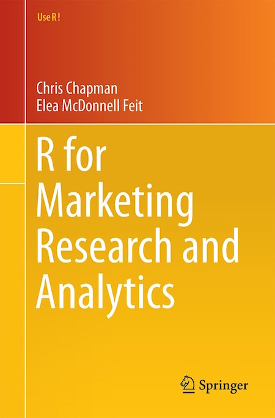

R for Behavioral Research
========================================================
Author:  Elea McDonnell Feit
Date: January 2018
width: 1300
height: 768

What tools do you use in your research workflow?
=========================================================

**Workflow** is the set of steps and tools you use to produce an output like a research paper. 

Does your workflow look like this?
=========================================================

What a mess! How many mistakes did you make cutting and pasting? What if you have to re-do it all?

What if your workflow looked like this? 
========================================================

By simplifying and automating your analysis process, you will **save time** and produce more **accurate** and **repeatable** analyses. 

Workshop Plan
========================================================
This week: 
- Introduction: why R? 
- Basics of R as a programming language (Chapter 2)

Assignment: 
- DataCamp: Introduction to Data

Next week: 
- Streamlining your workflow with R Markdown
- Live demo (data TBD)
  - Comparing groups: tables and visualizations (Chapter 5) 
  - Comparing groups: statistical tests (Chapter 6)
  - Linear regression (Chapter 7)

R for Marketing Research and Analytics
========================================================

* In this workshop, we follow the book [R for Marketing Research and Analtyics](http://r-marketing.r-forge.r-project.org/). The book uses examples that would be of interest to marketing research practitioners. 
* At the end of the workshop, we will apply our R skills to data from a marketing experiment, so you can get a feel for how these methods map to your own work. 
* Companion code files are available at (http://r-marketing.r-forge.r-project.org/), but we suggest you **type** each line of code, to begin developing your R skills.

***

The book authors
==========================================================
type: prompt

 

**Dr. Chris Chapman** is a Senior Quantitative Experience Researcher for the Google Cloud Platform, based in the Seattle office.

**Dr. Elea McDonnell Feit** is an Assistant Professor of Marketing at Drexel University and a Senior Fellow of the Wharton Customer Analytics Initiative. 

What is R?
========================================================

"R is a language and environment for statistical computing and graphics." [http://www.r-project.org/about.html](R Project)

R is:
- A programming language (not a ``stats program'')
- An environment for writing code and handling data
- User extensible through add ons and custom code
- Open source and freely available
- Where new statistics and analytics innovation most often happen first

What can you do with R? 
=======================================================
* Linear algebra computations
* Simulating data
* **Reading data from files**
* Manipulating (large) data 
* **Descriptive statistics (mean, median)**
* **Data visualization**
* **Regression**
* **Documenting analysis**
* Building data-oriented software products

**The highlighted topics are the focus of this workshop.**

What is R Not?
========================================================

R is not:
- Intended for point-and-click usage 
- Designed to hide complexity from the user 
- Necessarily a fast or easy way to do something that is new to you

Like learning a non-computer human language, R takes time, practice, patience, and application to real problems. You are not **doing** the analysis; you are writing a computer program to **do** the analysis. 

Why R?
========================================================
For behavioral doctoral students, the pay-off for R is: 
- More accurate, "reproducable" research
- Saves time when you have to re-do analysis, becuase you have a computer program to do it for you

What do you need to use R?
========================================================
At a minimum:
* R binaries from CRAN (Comprehensive R Archive Network)
* [http://cran.r-project.org]

Also recommended:
* RStudio IDE (integrated development environment)
* [http://www.rstudio.com]

RStudio is free and will make your life much easier! To use RStudio, first install R and then install RStudio separately.

Now ...
========================================================
type: alert

**Make sure R and RStudio are up and running on your systems!**

Once it is working for everyone, we'll start with the language.

